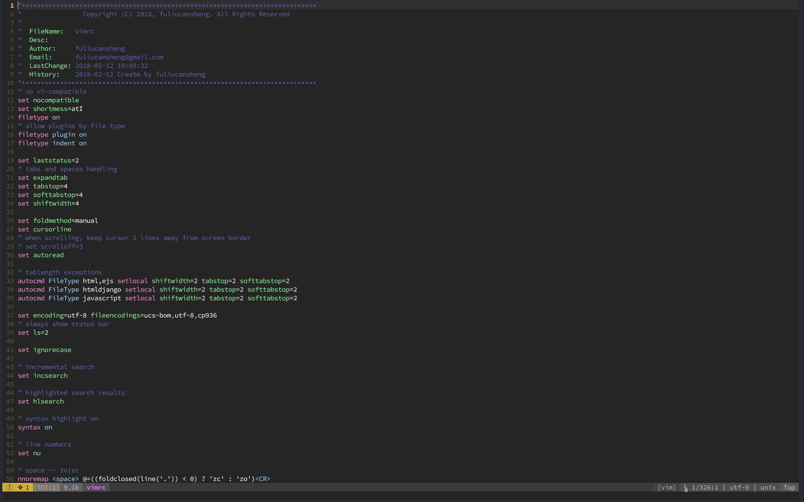

# Vim Configuare

### Installation

> 1. 将vimrc拷贝覆盖至用户home目录下的.vimrc
> 2. 配置vimrc中的用户名及email
> 3. vim打开任意文件
> 4. 运行:PlugInstall即可

### ScreenShot

### Plugins

* Common
  * [vim-surround](https://github.com/tpope/vim-surround)⭐️⭐️⭐️ - Easily delete, change and add surroundings in pairs.
  * [vim-repeat](https://github.com/tpope/vim-repeat)⭐⭐️⭐️ - Use **.** to repeat last action.
  * [ultisnips](https://github.com/SirVer/ultisnips)⭐️⭐️⭐️ - Ultimate solution for snippets.
  * [vim-snippets](https://github.com/SirVer/ultisnips)⭐️ - Ultimate solution for snippets.
  * [vim-autoformat](http://github.com/Chiel92/vim-autoformat)⭐️⭐️⭐️⭐️⭐️ - Format code with one button press.
  * [vim-easy-align](https://github.com/junegunn/vim-easy-align)⭐️ - A Vim alignment plugin
  * [vim-easymotion](https://github.com/easymotion/vim-easymotion)⭐️⭐️⭐️ - Vim motions on speed.
  * [vim-signature](https://github.com/kshenoy/vim-signature)⭐️⭐️⭐️ - Plugin to toggle, display and navigate marks
  * [vim-multiple-cursors](https://github.com/terryma/vim-multiple-cursors)⭐️ - Multiple selections for Vim
  * [vim-trailing-whitespace](https://github.com/bronson/vim-trailing-whitespace)⭐️ - Highlights trailing whitespace in red and :FixWhitespace to fix it.
  * [vim-rooter](https://github.com/airblade/vim-rooter)⭐️ - Changes Vim working directory to project root.
  * [vim-quickrun](https://github.com/thinca/vim-quickrun)⭐️⭐️⭐️ - Run commands quickly.
  * [vim-expand-region](https://github.com/terryma/vim-expand-region)⭐️ - Visually select increasingly larger regions of text.
  * [delimitMate](https://github.com/Raimondi/delimitMate)⭐️⭐️⭐️ - Auto-completion for quotes, parens, brackets, etc.
  * [undotree](https://github.com/mbbill/undotree)⭐️⭐️⭐️ - The ultimate undo history visualizer for VIM.
  * [vim-gitgutter](https://github.com/airblade/vim-gitgutter)⭐️⭐️⭐️⭐️⭐️  - Show a git diff in the 'gutter'.
  * [nerdtree](https://github.com/scrooloose/nerdtree)⭐️⭐️⭐️ - The ultimate undo history visualizer for VIM.
  * [nerdcommenter](https://github.com/scrooloose/nerdcommenter)⭐️⭐️⭐️ - Plugin for intensely orgasmic commenting.
  * [AuthorInfo](https://github.com/kingmilian/AuthorInfo)⭐️⭐️⭐️ - Vim Plugin AuthorInfo.
  * [vim-table-mode](https://github.com/dhruvasagar/vim-table-mode)⭐️ - VIM Table Mode for instant table creation.
  * [ctrlp.vim](https://github.com/kien/ctrlp.vim)⭐️ - Fuzzy file, buffer, mru, tag, etc finder.
  * [vim-ctrlp-cmdpalette](https://github.com/fisadev/vim-ctrlp-cmdpalette)⭐️  - Extension for ctrlp.vim.
  * [IndexedSearch](https://github.com/vim-scripts/IndexedSearch)⭐️⭐️⭐️ - Shows 'Nth match out of M' at every search.
  * [fzf](https://github.com/junegunn/fzf)⭐️⭐️⭐️ - fzf && vim
  * [tagbar](https://github.com/majutsushi/tagbar)⭐️⭐️⭐️ - Displays tags in a window, ordered by scope.
  * [dict.vim](https://github.com/iamcco/dict.vim)⭐️ - vim translation.
  * [supertab](https://github.com/ervandew/supertab)⭐️⭐️⭐️ - Completions with Tab
  * [LargeFile](https://github.com/vim-scripts/LargeFile)⭐️ - Edit large files quickly.
  * [rainbow](https://github.com/luochen1990/rainbow)⭐️⭐️⭐️ - Rainbow Parentheses.
  * [eleline.vim](https://github.com/liuchengxu/eleline.vim)⭐️ -  A tiny elegant statusline for vim.
  * [indentLine](https://github.com/Yggdroot/indentLine)⭐️⭐️⭐️ - Display the indention levels with thin vertical lines.
  * [vim-dracula](https://github.com/crusoexia/vim-dracula)⭐️⭐️⭐️ - Dracula color scheme for Vim.
  * [onedark.vim](https://github.com/joshdick/onedark.vim)⭐️⭐️⭐️ - Onedark color scheme for Vim.
  * [YouCompleteMe](https://github.com/Valloric/YouCompleteMe)⭐️⭐️⭐️⭐️⭐️  - A code-completion engine for Vim.
  * [vim-polyglot](https://github.com/sheerun/vim-polyglot)⭐️⭐️⭐️⭐️⭐️ - A solid language pack for Vim.
  * [ale](https://github.com/w0rp/ale)⭐️⭐️⭐️⭐️⭐️ - Asynchronous Lint Engine.
* Python
  * [jedi-vim](https://github.com/davidhalter/jedi-vim)⭐️⭐️⭐️ - Using the jedi autocompletion library for VIM.
* Web
  * [emmet-vim](https://github.com/mattn/emmet-vim)⭐️ - Emmet for vim.
  * [MatchTag](https://github.com/gregsexton/MatchTag)⭐️ - Vim's MatchParen for HTML tags.
  * [closetag.vim](https://github.com/docunext/closetag.vim)⭐️ - Functions and mappings to close open HTML/XML tags.
  * [vim-javascript](https://github.com/pangloss/vim-javascript)⭐️ - Vastly improved Javascript indentation and syntax support in Vim. 
  * [tern_for_vim](https://github.com/ternjs/tern_for_vim)⭐️⭐️⭐️ - Tern plugin for Vim.
* Go
  * [vim-go](https://github.com/fatih/vim-go)⭐️⭐️⭐️ - Go development plugin for Vim.
* Shell
  * [bash-support.vim](https://github.com/vim-scripts/bash-support.vim)⭐️ - BASH IDE -- Write and run BASH-scripts using menus and hotkeys.
