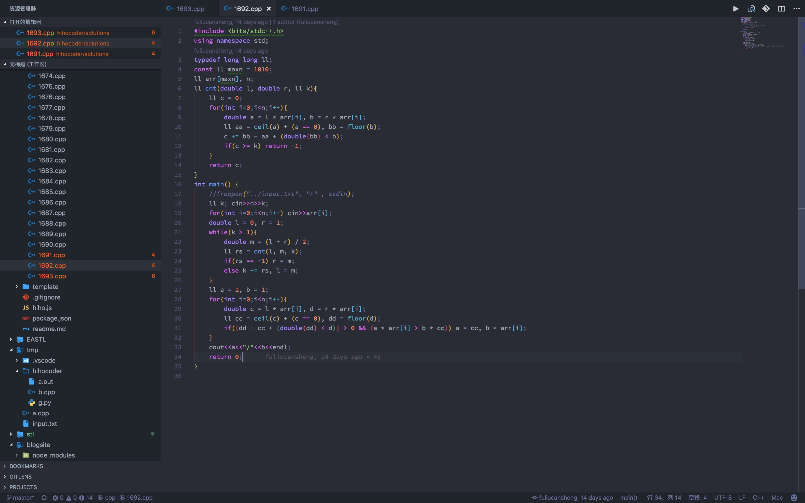

# Vscode Configure

### ScreenShot

### Installation

> 在vscode扩展中搜索安装即可。

### Plugins

- Auto Close Tag
- Auto Rename Tag
- Beautify⭐️⭐️⭐️⭐️⭐️
- Bookmarks
- C/C++
- C/C++ Snippets
- C++ Intellisense
- Clang-Format
- Code Runner⭐️⭐️⭐️⭐️
- Code Spell Checker⭐️⭐️⭐️⭐️
- Dracula Official⭐️⭐️⭐️⭐️
- ESLint
- Eva Theme⭐️⭐️⭐️⭐️
- GitLens — Git supercharged⭐️⭐️⭐️⭐️⭐️
- Go
- Guides
- JS Refactor
- markdownlint⭐️⭐️
- Material Icon Theme⭐️⭐️
- Node.js Modules Intellisense
- npm
- Npm Intellisense
- One Dark Pro⭐️⭐️⭐️
- Path Intellisense⭐️⭐️⭐️⭐️⭐️
- Project Manager
- Python⭐️⭐️⭐️
- Rainbow Brackets⭐️⭐️⭐️⭐️
- Rainbow CSV⭐️
- Remote VSCode
- Settings Sync⭐️⭐️⭐️⭐️⭐️
- sftp⭐️⭐️⭐️⭐️⭐️
- Ternjs
- TODO Highlight⭐️
- VSCode Great Icons⭐️⭐️
- vscode-author-generator⭐️⭐️⭐️
- vscode-icons⭐️⭐️

