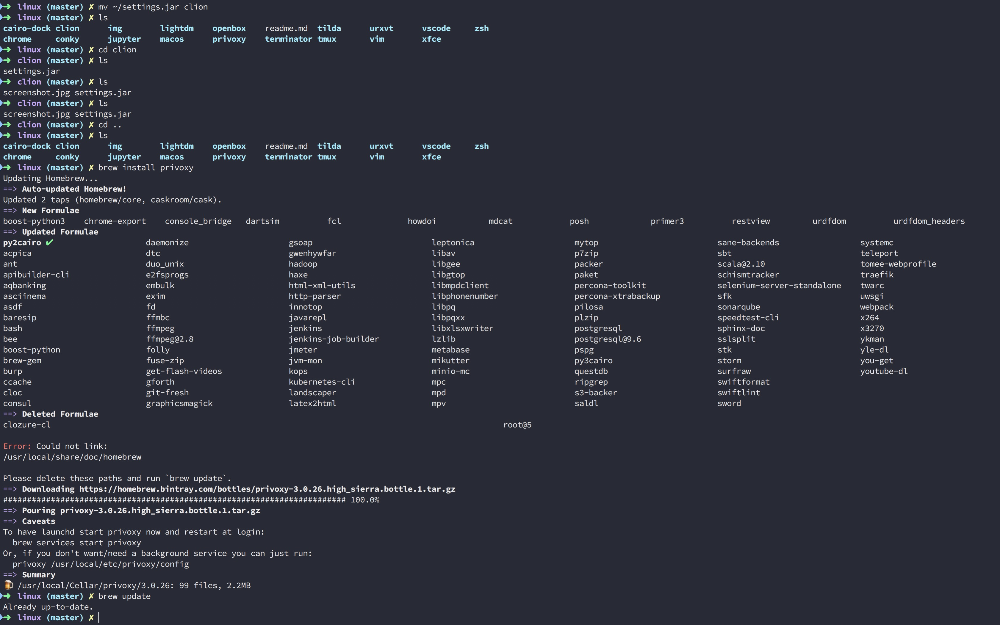

# Zsh Configure

### ScreenShot

### Installation

> 1. 安装[Zsh Shell](http://www.zsh.org/) 及 [Oh my zsh](https://github.com/robbyrussell/oh-my-zsh)
> 2. 安装[Dracula Theme](https://draculatheme.com/)
> 3. 将zshrc拷贝覆盖至用户home目录下的.zshrc即可

